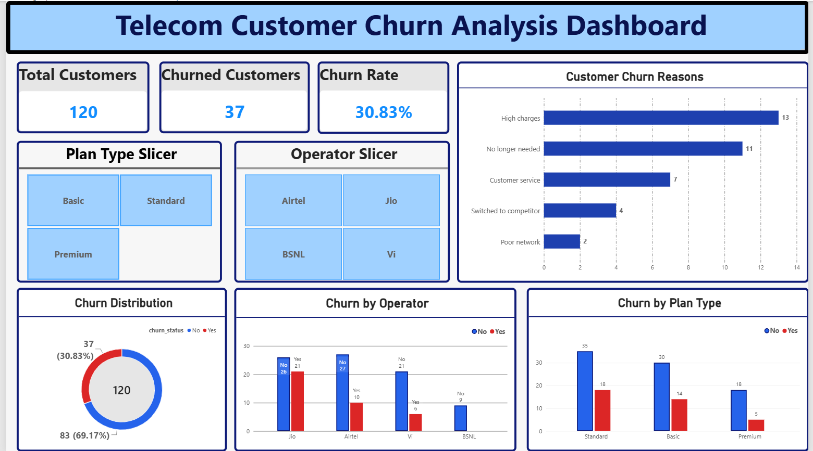

# Telecom Customer Churn Analysis

## 📌 Project Overview

This project analyzes customer churn for a synthetic telecom dataset using Python, SQL, and Power BI.

The goal is to identify customer churn patterns, understand major churn reasons, and analyze churn across operators and plan types.

## 🛠️ Tools & Technologies

- Python
- Pandas
- Matplotlib
- Seaborn
- SQL
- Power BI
- Jupyter Notebook

## 📊 Key KPIs

| KPI | Value |
|---|---:|
| Total Customers | 120 |
| Churned Customers | 37 |
| Churn Rate | 30.83% |
| Retained Customers | 83 |
| Retention Rate | 69.17% |

## 🔍 Analysis Performed

### Data Cleaning
- Handled missing values
- Removed duplicate records
- Standardized categorical values
- Converted date columns to proper datetime format
- Validated numerical fields

### Churn Analysis
- Overall customer churn rate
- Churn by telecom operator
- Churn by plan type
- Customer churn reasons
- Churn distribution

## 📈 Key Findings

- Overall customer churn rate is **30.83%**.
- **37 out of 120 customers** have churned.
- **Jio** has the highest churn rate among the operators in this dataset.
- **Standard** plan has the highest number of churned customers.
- **High charges** is the most common recorded churn reason.

## 📊 Power BI Dashboard
 - 

The Power BI dashboard provides an interactive view of:

- Total Customers
- Churned Customers
- Churn Rate
- Customer Churn Distribution
- Churn by Operator
- Churn by Plan Type
- Customer Churn Reasons
- Plan Type filter
- Operator filter

## 📁 Project Files

- `Telecom_Customer_Churn_Analysis_DashBoard.pbix` — Power BI dashboard
- `telecom_customer_churn_data_analysis.ipynb` — Python analysis and data cleaning
- `telecom_churn_cleaned.csv` — Cleaned dataset

## ⚠️ Dataset Note

This project uses a **synthetic telecom customer dataset created for learning and portfolio purposes**. The data does not represent a real telecom company's customers.

## 🎯 Project Objective

The project demonstrates an end-to-end data analytics workflow:

**Raw Data → Data Cleaning → Exploratory Analysis → SQL Analysis → Power BI Dashboard → Business Insights**

## 👤 Author

**Awanish Kumar Patel**

B.Tech CSE Student  
Interested in Data Analytics, Python, SQL, and Power BI.
